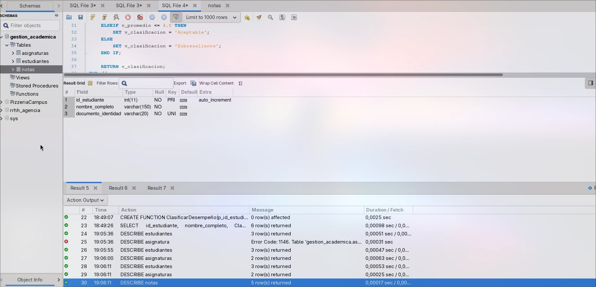
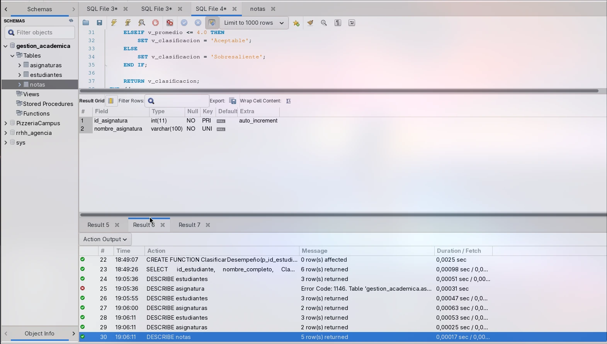
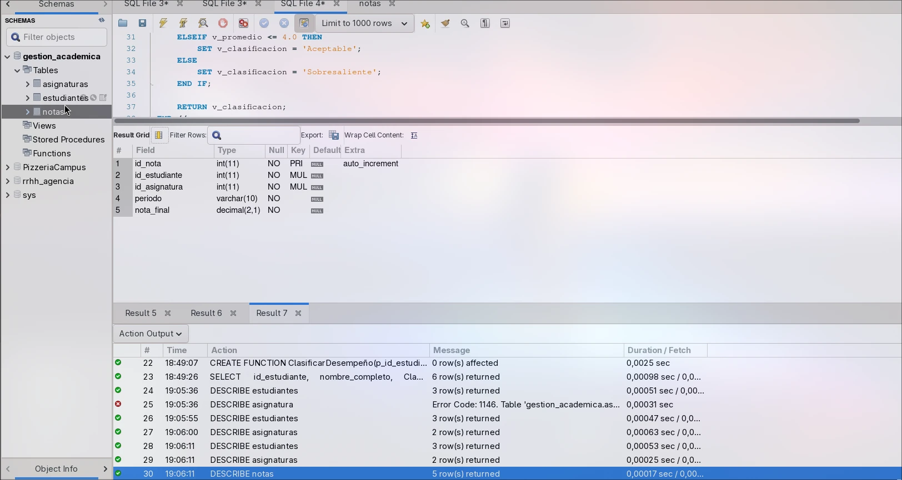
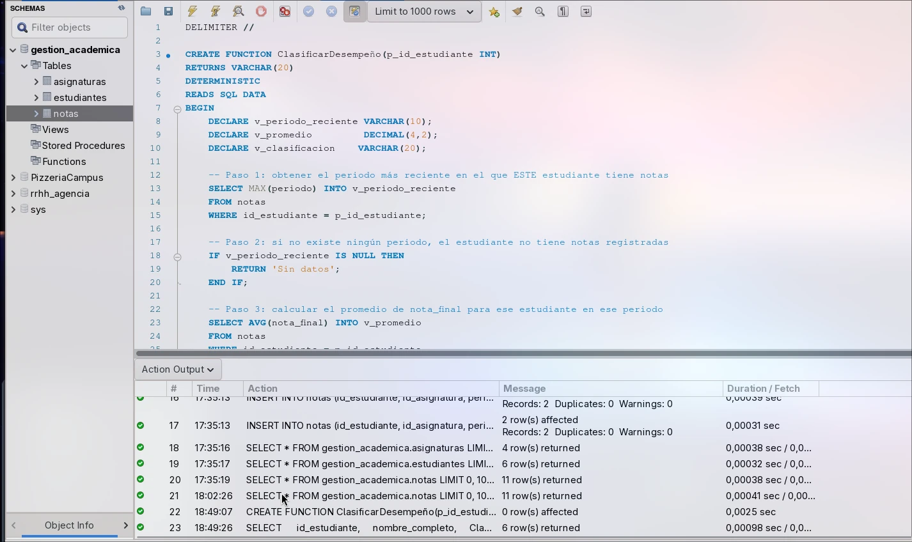
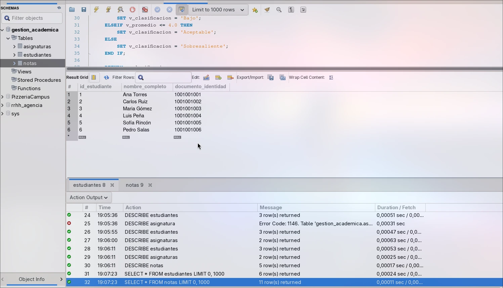
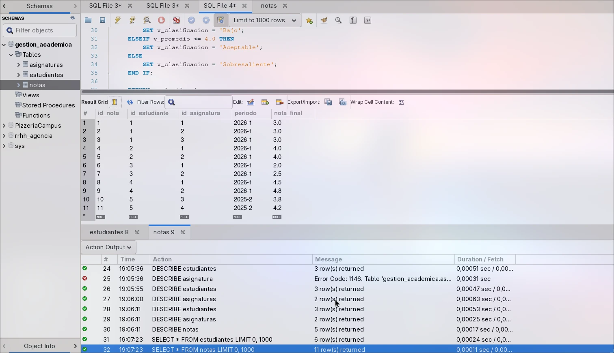
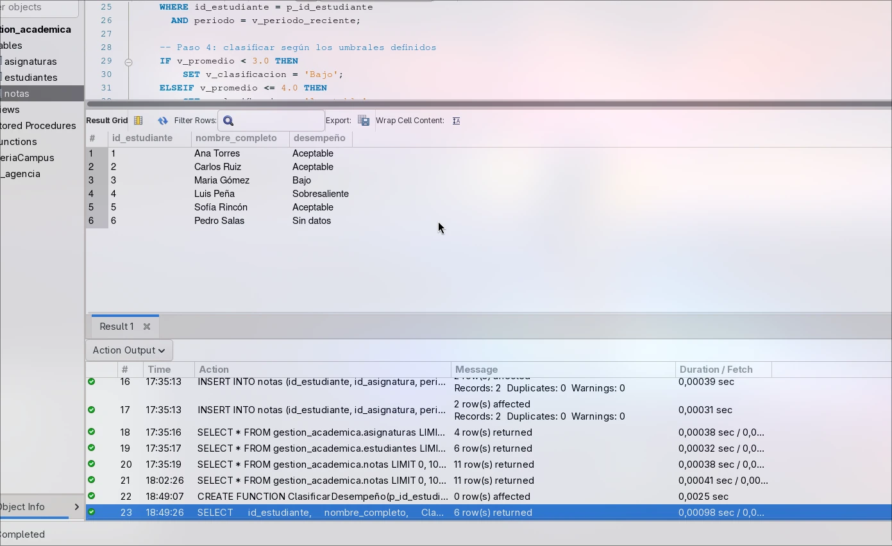
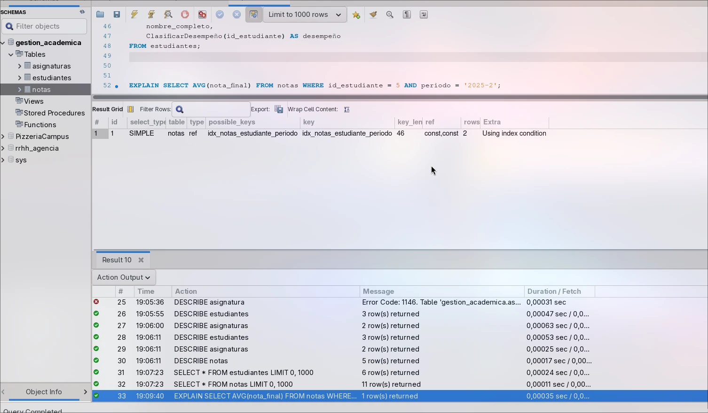

# Clasificación de Desempeño Académico — MySQL 8

Proyecto académico de MySQL enfocado en el diseño de una base de datos normalizada y la implementación de una función definida por el usuario (`ClasificarDesempeño`) que evalúa el rendimiento académico de un estudiante a partir del promedio de sus notas.

El proyecto no se limita a resolver el ejercicio propuesto: incluye diseño relacional desde cero, normalización justificada paso a paso, datos de prueba diseñados para casos límite, verificación de rendimiento con `EXPLAIN`, y documentación técnica completa de cada decisión tomada.

---

## Tabla de contenido

- [Objetivo del proyecto](#objetivo-del-proyecto)
- [Tecnologías utilizadas](#tecnologías-utilizadas)
- [Estructura del proyecto](#estructura-del-proyecto)
- [Modelo de datos](#modelo-de-datos)
- [Normalización](#normalización)
- [Cómo ejecutar el proyecto](#cómo-ejecutar-el-proyecto)
- [La función `ClasificarDesempeño`](#la-función-clasificardesempeño)
- [Consultas importantes](#consultas-importantes)
- [Evidencia de funcionamiento](#evidencia-de-funcionamiento)
- [Optimización](#optimización)
- [Decisiones de diseño y por qué se tomaron](#decisiones-de-diseño-y-por-qué-se-tomaron)
- [Aprendizajes](#aprendizajes)
- [Conclusiones](#conclusiones)
- [Autor](#autor)
- [Licencia](#licencia)

---

## Objetivo del proyecto

Diseñar y construir, desde cero, una base de datos relacional para una institución educativa capaz de:

1. Almacenar estudiantes, asignaturas y notas de forma normalizada e íntegra.
2. Clasificar automáticamente el desempeño académico de un estudiante mediante una función definida por el usuario (`ClasificarDesempeño`), según su promedio de notas:
   - Promedio `< 3.0` → `'Bajo'`
   - Promedio entre `3.0` y `4.0` (inclusive) → `'Aceptable'`
   - Promedio `> 4.0` → `'Sobresaliente'`
   - Sin notas registradas → `'Sin datos'`

El proyecto se desarrolló siguiendo un flujo profesional de ingeniería de datos: análisis de requisitos → diseño → normalización → implementación → pruebas → optimización → documentación.

---

## Tecnologías utilizadas

| Tecnología | Versión / detalle |
|---|---|
| Motor de base de datos | MySQL 8.x (probado también en MariaDB 10.11, compatible en toda la sintaxis usada) |
| Lenguaje | SQL estándar de MySQL (DDL, DML, funciones almacenadas) |
| Cliente usado para pruebas | MySQL Workbench |

---

## Estructura del proyecto

```
├── README.md
└── proyecto_academico.sql   -- Script completo: creación de BD, tablas, datos de prueba y función
```

---

## Modelo de datos

El modelo se compone de tres tablas relacionadas:

- **`estudiantes`**: registra a cada estudiante con un identificador único.
- **`asignaturas`**: catálogo de materias, separado para evitar redundancia y anomalías de actualización.
- **`notas`**: tabla central que conecta estudiante + asignatura + periodo académico + nota final.

```sql
CREATE TABLE estudiantes (
    id_estudiante       INT AUTO_INCREMENT,
    nombre_completo     VARCHAR(150) NOT NULL,
    documento_identidad VARCHAR(20)  NOT NULL,
    PRIMARY KEY (id_estudiante),
    UNIQUE KEY uq_documento_identidad (documento_identidad)
);

CREATE TABLE asignaturas (
    id_asignatura     INT AUTO_INCREMENT,
    nombre_asignatura VARCHAR(100) NOT NULL,
    PRIMARY KEY (id_asignatura),
    UNIQUE KEY uq_nombre_asignatura (nombre_asignatura)
);

CREATE TABLE notas (
    id_nota       INT AUTO_INCREMENT,
    id_estudiante INT NOT NULL,
    id_asignatura INT NOT NULL,
    periodo       VARCHAR(10) NOT NULL,
    nota_final    DECIMAL(2,1) NOT NULL,
    PRIMARY KEY (id_nota),
    CONSTRAINT fk_notas_estudiante
        FOREIGN KEY (id_estudiante) REFERENCES estudiantes(id_estudiante)
        ON DELETE CASCADE ON UPDATE CASCADE,
    CONSTRAINT fk_notas_asignatura
        FOREIGN KEY (id_asignatura) REFERENCES asignaturas(id_asignatura)
        ON DELETE RESTRICT ON UPDATE CASCADE,
    CONSTRAINT chk_nota_rango
        CHECK (nota_final >= 0.0 AND nota_final <= 5.0),
    INDEX idx_notas_estudiante_periodo (id_estudiante, periodo)
);
```

**Estructura real de las tablas (`DESCRIBE`):**







---

## Normalización

El modelo fue verificado formalmente contra cada forma normal, no solo declarado como "normalizado":

| Forma | Estado | Justificación resumida |
|---|---|---|
| **1FN** | ✅ Cumple | Todos los valores son atómicos; cada tabla tiene una clave primaria que identifica de forma única cada fila. |
| **2FN** | ✅ Cumple | Las claves primarias son simples (no compuestas), por lo que no puede existir dependencia parcial. |
| **3FN** | ✅ Cumple | No hay dependencias transitivas: ningún atributo no-clave depende de otro atributo no-clave (por ejemplo, los créditos de una asignatura irían en `asignaturas`, nunca duplicados en `notas`). |
| **BCNF** | ✅ Cumple | Consecuencia directa de 3FN combinada con una única clave candidata por tabla. |
| **4FN** | No aplica | No existen atributos multivaluados independientes que gestionar en este modelo. |

---

## Cómo ejecutar el proyecto

1. Tener instalado MySQL 8 (o MariaDB 10.x) y acceso a un cliente (MySQL Workbench, consola `mysql`, DBeaver, etc.).
2. Clonar este repositorio.
3. Ejecutar el script completo:

```bash
mysql -u tu_usuario -p < proyecto_academico.sql
```

Esto crea la base de datos `gestion_academica`, las tres tablas, los datos de prueba y la función `ClasificarDesempeño`, todo en un solo paso.

4. Probar la función:

```sql
USE gestion_academica;

SELECT
    id_estudiante,
    nombre_completo,
    ClasificarDesempeño(id_estudiante) AS clasificacion
FROM estudiantes;
```

---

## La función `ClasificarDesempeño`

```sql
DELIMITER //

CREATE FUNCTION ClasificarDesempeño(p_id_estudiante INT)
RETURNS VARCHAR(20)
DETERMINISTIC
READS SQL DATA
BEGIN
    DECLARE v_periodo_reciente VARCHAR(10);
    DECLARE v_promedio         DECIMAL(4,2);
    DECLARE v_clasificacion    VARCHAR(20);

    -- Periodo académico más reciente de ESTE estudiante (no un periodo global fijo)
    SELECT MAX(periodo) INTO v_periodo_reciente
    FROM notas
    WHERE id_estudiante = p_id_estudiante;

    -- Si no tiene ningún periodo, no tiene notas registradas
    IF v_periodo_reciente IS NULL THEN
        RETURN 'Sin datos';
    END IF;

    -- Promedio del estudiante en su periodo más reciente
    SELECT AVG(nota_final) INTO v_promedio
    FROM notas
    WHERE id_estudiante = p_id_estudiante
      AND periodo = v_periodo_reciente;

    IF v_promedio < 3.0 THEN
        SET v_clasificacion = 'Bajo';
    ELSEIF v_promedio <= 4.0 THEN
        SET v_clasificacion = 'Aceptable';
    ELSE
        SET v_clasificacion = 'Sobresaliente';
    END IF;

    RETURN v_clasificacion;
END //

DELIMITER ;
```

### ¿Por qué `DETERMINISTIC READS SQL DATA`?

- **`READS SQL DATA`** es obligatoria porque la función consulta la tabla `notas` mediante `SELECT`.
- **`DETERMINISTIC`** es correcta porque, para el mismo `id_estudiante` y con el mismo contenido de la tabla `notas`, la función **siempre** devuelve la misma clasificación. No depende de la hora del sistema, de valores aleatorios ni de ninguna variable externa al propio estado de los datos — solo del estudiante y de sus notas. Una función puede ser determinística y leer datos al mismo tiempo; ambas cosas no son contradictorias.

**Creación exitosa de la función (ver el log de acciones, fila 22):**



---

## Consultas importantes

**Datos de prueba insertados:**





**Consulta de evidencia (usa la función sobre todos los estudiantes):**

```sql
SELECT
    id_estudiante,
    nombre_completo,
    ClasificarDesempeño(id_estudiante) AS clasificacion
FROM estudiantes;
```

---

## Evidencia de funcionamiento

Se diseñaron 6 casos de prueba específicos para validar cada rama de la lógica condicional, incluyendo los casos límite:

| Estudiante | Escenario probado | Resultado esperado | Resultado obtenido |
|---|---|---|---|
| Ana Torres | Promedio exacto en 3.0 (límite inferior de "Aceptable") | Aceptable | Aceptable ✅ |
| Carlos Ruiz | Promedio exacto en 4.0 (límite superior de "Aceptable") | Aceptable | Aceptable ✅ |
| Maria Gómez | Promedio por debajo de 3.0 | Bajo | Bajo ✅ |
| Luis Peña | Promedio por encima de 4.0 | Sobresaliente | Sobresaliente ✅ |
| Sofía Rincón | Solo tiene notas en un periodo anterior (no en el más reciente global) | Aceptable, usando su propio periodo más reciente | Aceptable ✅ |
| Pedro Salas | Sin ninguna nota registrada | Sin datos | Sin datos ✅ |

El caso de **Sofía Rincón** es el más relevante: valida que la función calcula el periodo más reciente **de cada estudiante individualmente**, y no asume un periodo global fijo para todos.



---

## Optimización

Se verificó con `EXPLAIN` que las dos consultas internas de la función usan efectivamente el índice `idx_notas_estudiante_periodo`, evitando recorridos completos de tabla (`type: ALL`) a favor de accesos directos por índice (`type: ref`, y en un caso `Select tables optimized away`).

```sql
EXPLAIN SELECT AVG(nota_final) FROM notas
WHERE id_estudiante = 5 AND periodo = '2025-2';
```



---

## Decisiones de diseño y por qué se tomaron

- **`DECIMAL` en vez de `FLOAT` para las notas**: evita errores de precisión de punto flotante que podrían alterar comparaciones exactas contra los umbrales 3.0 y 4.0.
- **Tabla `asignaturas` separada**: evita redundancia y anomalías de actualización si el nombre de una materia cambia.
- **`ON DELETE CASCADE` en la FK hacia `estudiantes`, pero `ON DELETE RESTRICT` hacia `asignaturas`**: borrar un estudiante borra en cascada sus propias notas (tiene sentido de negocio), pero borrar una asignatura completa con notas asociadas se bloquea explícitamente, porque afectaría a todos los estudiantes de esa materia a la vez.
- **El promedio se calcula sobre el periodo más reciente del estudiante, no de forma histórica total**: la función recibe un único parámetro (`id_estudiante`), tal como exige el enunciado original, y resuelve internamente cuál es el periodo vigente de cada estudiante.
- **Nombrado de parámetros con prefijo `p_`**: evita ambigüedad entre el parámetro de la función y las columnas de la tabla con el mismo nombre.
- **Manejo explícito de "sin datos"**: la función corta la ejecución con `RETURN 'Sin datos'` en vez de dejar que un `AVG()` sobre datos inexistentes produzca un `NULL` silencioso.

---

## Aprendizajes

- Diferencia práctica entre funciones `DETERMINISTIC` y `NOT DETERMINISTIC`, y por qué ambas pueden convivir con `READS SQL DATA`.
- Por qué `DECIMAL` es la elección correcta frente a `FLOAT` cuando se trabaja con comparaciones exactas.
- Aplicación real (no solo teórica) de las formas normales sobre un caso de negocio concreto.
- Uso de `EXPLAIN` para verificar, con evidencia, si un índice está siendo aprovechado por el optimizador de consultas.
- Diseño de datos de prueba orientado a casos límite, no solo a "casos felices".

---

## Conclusiones

El proyecto cumple los requisitos del ejercicio original y los amplía con una base de datos normalizada, datos de prueba diseñados para casos límite y verificación de rendimiento con evidencia real de ejecución. Cada decisión técnica — desde el tipo de dato de una columna hasta la política de borrado en cascada — quedó justificada y documentada, siguiendo un flujo de trabajo equivalente al de un proyecto profesional de ingeniería de datos.

---

## Autor

**Samuel David Gelvez Rodriguez**
